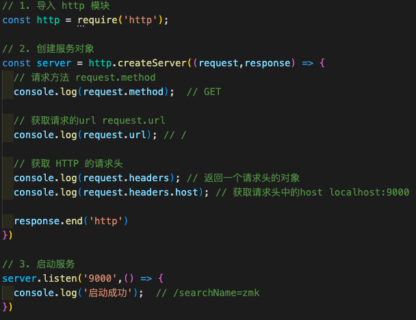

<!--
 * @Author: zhangmaokai zmkfml@163.com
 * @Date: 2023-08-01 10:39:26
 * @LastEditors: zhangmaokai zmkfml@163.com
 * @LastEditTime: 2023-08-16 15:11:24
 * @FilePath: /记录/FullStacker/frontend/base/5-NodeJS.md
 * @Description: nodejs学习
-->


NodeJS 整理[👉 点击](../../images/nodejs/nodejs-line.avif)

## 一、NodeJS

### 1.1 NodeJS 是什么

NodeJS 是一个<strong style="color: red">开源的</strong>，<strong style="color: red">跨平台</strong>的 JavaScript 运行环境

下载地址[👉https://nodejs.org/zh-tw/download](https://nodejs.org/zh-tw/download)

### 1.2 NodeJS 作用

1. 开发服务端应用
2. 开发工具类应用（webpack、vite、babel）
3. 开发桌面端应用（electron: vscode、figma、postman）

### 1.3 NodeJS 编码注意事项


⚠️ 注意：

1. nodejs 中的顶级对象是 `global` ，可以使用 globalThis 访问顶级对象
2. nodejs 中不能使用 BOM 和 DOM 的 API，但是可以使用 console 和定时器 API

## 二、Node 内置模块 Buffer

buffer 是一个类似于数组的对象，本质是一段内存空间，专门用来处理二进制数据


## 三、Node 内置模块 🌟fs 模块

### 3.1 文件写入

> 异步/同步写入 `writeFile/wrieFileSync`


> 追加写入 `appendFile`


> 流式写入 `createWriteStream`

⚠️ 流式写入适用于`大文件写入或者频繁写入`的场景，**writeFile**适用于`写入频率较低的场景`


`文件写入`在计算机中是个非常常见的操作，下面的场景都用到了文件写入：下载文件、安装文件、保存程序日志（如 git）、编辑器保存文件、视频录制等。

### 3.2 文件读取

> 异步/同步读取 `readFile/readFileSync`


> 流式读取 `createReadStream`


> 练习：复制文件


### 3.3 文件重命名与移动 `rename`


### 3.4 文件删除 `unlink/rm`


### 3.5 文件夹操作

> 创建文件夹 `mkdir`


> 读取文件夹 `readdir`


> 删除文件夹 `rmdir`


### 3.6 查看资源状态


### 3.7 相对路径

相对路径参照物：命令行的工作目录

‘全局变量’ `__dirname`: 所在文件的所在目录的绝对路径


## 四、Node 内置模块 🌟path 模块

> path 常用 api


> 拼接规范的绝对路径 resolve 常用


## 五、Node 内置模块 🌟http 模块

> 创建 http 服务


> http 模块 获取请求`行`和请求`头`



> http 模块 获取请求`体`


> http 模块 获取请求路径和查询参数


> http 模块 设置响应报文


> http 模块 搭建静态资源服务


> 相对路径和绝对路径

- 相对路径
  

- 绝对路径
  

> 设置 mime 类型


## 六、NodeJS 模块化

### 6.1 什么是模块化与模块？

将一个复杂的程序文件依据一定的规则（规范）拆分成多个文件的过程称之为`模块化`
其中拆分出的`每一个文件就是一个模块`，模块的内部数据是私有的，不过模块可以暴露内部数据以便其他模块使用
编码时是按照模块一个个编码的，整个项目就是一个`模块化的项目`

模块化主要有以下几点好处：

1. 防止命名冲突
2. 高复用性
3. 高维护性

### 6.2 暴露数据

模块暴露数据的方式有两种：

1. **module.exports=value**
2. **exports.name=value**

> 使用时有几点注意：
>
> - module.export 可以暴露**任意**数据 `require`函数返回的是 module.export 中的值
> - ⚠️ 不能使用`exports = value`的形式暴露数据，模块内部 module 与 exports 的隐式关系`exports = module.exports = {}`


### 6.3 导入文件/文件夹模块

🌟 注意事项：

- 导入时建议写相对路径
- 导入的是 js/json 文件可以不用写后缀（⚠️ 如果 js 和 json 文件同名，则省略后缀先导入的是 js 文件）
- ⚠️ 如果导入的是文件夹，会首先检测该文件夹下的 package.json 文件中 main 属性对应的文件（存在则导入，不存在报错）
- 如果文件夹下的 main 属性不存在，或者 package.json 不存在，则会尝试导入文件夹下的 index.js 和 index.json 文件（还未找到，则报错）
- 导入 nodejs 内置模块时，直接 require 模块名即可

### 6.4 `require`导入`自定义模块`的基本流程

1. 将相对路径转为绝对路径，定位目标文件
2. 缓存检测
3. 读取目标文件代码
4. 包裹为一个函数并执行（自执行函数），通过`arguments.callee.toString()`查看自执行函数
5. 缓存模块的值
6. 返回`module.exports`的值

### 6.5 CommonJS 规范

`module.export`、`exports`以及`require`这些都是**CommonJS**模块化规范中的内容，而 Node.js 是实现了 CommonJS 模块化规范，二者关系有点像 JavaScipt 与 ECMAScript。

## 七、NodeJS 包管理工具（NPM）


### 安装 nvm (node 版本管理器 mac m1 pro 版)

**执行安装命令**

```bash
curl -o- https://raw.githubusercontent.com/nvm-sh/nvm/v0.37.1/install.sh | bash
```

**配置.zshrc**

```bash
# 进入到
vim ~/.zshrc

# 填写以下内容
export NVM_DIR="$HOME/.nvm"
[ -s "$NVM_DIR/nvm.sh" ] && \. "$NVM_DIR/nvm.sh"  # This loads nvm
[ -s "$NVM_DIR/bash_completion" ] && \. "$NVM_DIR/bash_completion" # This loads nvm bash_completion

# 退出保存
source ~/.zshrc
```

**下载低于 node15 的版本**

```bash
node -p process.arch  #查看当前架构
arch -x86_64 zsh      #更换为64位架构
nvm install v12.22.10 #下载低于15版本的Node
exit                  #退出zsh
nvm use v12.22.10     #使用低于15版本的Node
```

**nvm 常用命令**

```bash
# 最新稳定版本
nvm install stable
# 列出所有可安装的版本
nvm ls-remote
# 列出所有已经安装的版本
nvm ls
# 切换使用指定的版本
nvm use <version>
# 显示当前使用的版本
nvm current
# 设置默认 `node` 版本
nvm alias default <version>
# 解除当前版本绑定
nvm deactivate
# 删除某版本的node
nvm uninstall <version>
```
