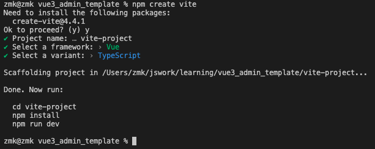
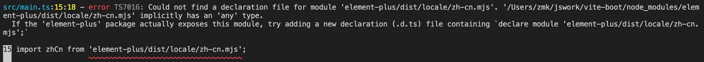
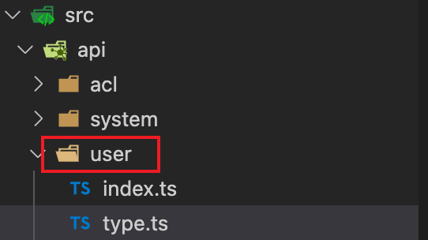
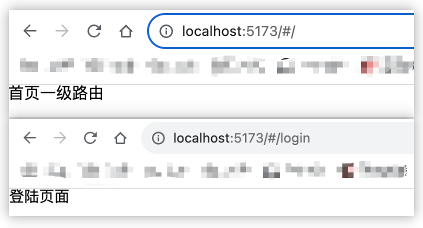
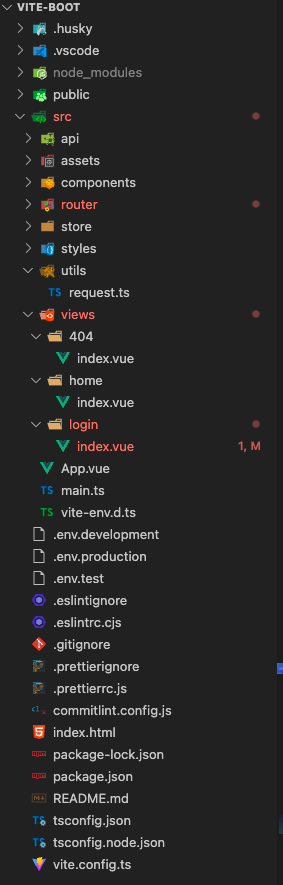

<!--
 * @Author: zhangmaokai zmkfml@163.com
 * @Date: 2023-08-10 15:31:03
 * @LastEditors: zhangmaokai zmkfml@163.com
 * @LastEditTime: 2023-11-02 14:57:12
 * @FilePath: /记录/FullStacker/frontend/vite-boot.md
 * @Description: vite-boot模板搭建
-->

# vite-boot 模板搭建

### 1.1 环境准备

- node v18.17.0
- npm 9.5.0

### 1.2 项目初始化



### 1.3 项目配置

#### 1.3.1 eslint 配置

首先安装 eslint

```bash
npm i eslint -D

# package.json 安装的插件
"eslint": "^8.46.0",
"eslint-plugin-vue": "^9.17.0",
```

生成配置文件

```bash
npx eslint --init

# package.json 安装的插件
"@typescript-eslint/eslint-plugin": "^6.3.0",
"@typescript-eslint/parser": "^6.3.0",
"@vitejs/plugin-vue": "^4.2.3",
```


可以发现安装完成，vite-project 项目中多了一个 ==.eslintrc.cjs== 文件（里面配置内容需要安装需求替换）。

> 1. vue3 环境代码校验插件

安装指令

```bash
npm install -D eslint-plugin-import eslint-plugin-vue eslint-plugin-node eslint-plugin-prettier eslint-config-prettier @babel/eslint-parser
```

```bash
# 让所有与prettier规则存在冲突的eslint rules失效，并使用prettier进行代码检查
"eslint-config-prettier": "^9.0.0",
"eslint-plugin-import": "^2.28.0",
"eslint-plugin-node": "^11.1.0",

# 运行更漂亮的eslint，使prettier规则优先级更高，eslint优先级更低
"eslint-plugin-prettier": "^5.0.0",

# vue.js的eslint插件(查找vue语法错误，发现错误指令，查找违规风格指南)
"eslint-plugin-vue": "^9.17.0",

# 该解析器允许使用eslint校验所有babel code
"@babel/eslint-parser": "^7.22.10",
```

> 2. 修改 eslinrc.js 的配置

```js
module.exports = {
	env: {
		browser: true,
		es2021: true,
		node: true,
		jest: true,
	},
	/* 指定如何解析语法 */
	parser: 'vue-eslint-parser',
	/** 优先级低于 parse 的语法解析配置 */
	parserOptions: {
		ecmaVersion: 'latest',
		sourceType: 'module',
		parser: '@typescript-eslint/parser',
		jsxPragma: 'React',
		ecmaFeatures: {
			jsx: true,
		},
	},
	/* 继承已有的规则 */
	extends: ['eslint:recommended', 'plugin:vue/vue3-essential', 'plugin:@typescript-eslint/recommended', 'plugin:prettier/recommended'],
	plugins: ['vue', '@typescript-eslint'],

	/*
	 * "off"或0   关闭规则
	 * "warn"或1  打开的规则作为警告 (不影响代码执行)
	 * "error"或2 规则作为一个错误 (代码不能执行，界面报错)
	 */
	rules: {
		// eslint (https://eslint.bootcss.com/docs/rules/)
		'no-var': 'error', // 要求使用 let 或 const 而不是 var
		'no-multiple-empty-lines': ['warn', { max: 1 }], // 不允许多个空行
		'no-unexpected-multiline': 'error', // 禁止空余的多行
		'no-useless-escape': 'off', // 禁止不必要的转义字符

		// typeScript (https://typescript-eslint.io/rules)
		'@typescript-eslint/no-unused-vars': 'error', // 禁止定义未使用的变量
		// '@typescript-eslint/prefer-ts-expect-error': 'error', // 禁止使用 @ts-ignore
		'@typescript-eslint/ban-ts-comment': 'off',
		'@typescript-eslint/no-non-null-assertion': 'off',
		'@typescript-eslint/no-empty-function': 'off', // 关闭空方法检查
		'@typescript-eslint/no-explicit-any': 'off', // 关闭any类型的警告

		//elint-plugin-vue (https://eslint.yueis.ora/rules/)
		'vue/multi-word-component-names': 'off', // 要求组件名称始终为“-”链接的单词
		'vue/script-setup-uses-vars': 'error', // 防上<script setup>使用的变量<template>被标记为未使用
		'vue/no-mutating-props': 'off', // 不允许组件 prop的改变
		'vue/attribute-hyphenation': 'off', // 对模板中的自定义组件强制执行属性命名样式
	},
};
```

> 1.3 .eslintignore 忽略文件

```bash
dist
node_modules
```

> 1.4 添加运行脚本

```bash
"scripts": {
    "lint": "eslint src",
    "fix": "eslint src --fix"

    # 或者
    "lint": "eslint src/**/*.{ts,vue} --fix",
  },
```

#### 1.3.2 prettier 配置

有了 eslint，为什么还要有 prettier？eslint 针对的是 javascript，它是一个检测工具，包含 js 语法以及少部分格式问题，在 eslint 看来，语法对了就能保证代码正常运行，格式属于其次。
而 prettier 属于格式化工具，它看不惯格式不统一，另外 prettier 支持包含 js 在內的多种语言。
总结：**eslint 和 prettier 一个保证 js 代码质量，一个保证代码美观**

> 1. 安装依赖包

```bash
npm install -D eslint-plugin-prettier prettier eslint-config-prettier

# package.json 安装的插件
"prettier": "^3.0.1",
```

> 2. 配置 prettier 格式化文档 填加规则

```js
/** .prettierrc.js
 * 在VSCode中安装prettier插件 打开插件配置填写`.prettierrc.js` 将本文件作为其代码格式化规范
 * 在本文件中修改格式化规则，不会同时触发改变ESLint代码检查，所以每次修改本文件需要重启VSCode，ESLint检查才能同步代码格式化
 * 需要相应的代码格式化规范请自行查阅配置，下面为默认项目配置
 */
module.exports = {
  // 一行最多多少个字符
  printWidth: 150,
  // 指定每个缩进级别的空格数
  tabWidth: 2,
  // 使用制表符而不是空格缩进行
  useTabs: true,
  // 在语句末尾是否需要分号
  semi: true,
  // 是否使用单引号
  singleQuote: true,
  // 更改引用对象属性的时间 可选值"<as-needed|consistent|preserve>"
  quoteProps: 'as-needed',
  // 在JSX中使用单引号而不是双引号
  jsxSingleQuote: false,
  // 多行时尽可能打印尾随逗号。（例如，单行数组永远不会出现逗号结尾。） 可选值"<none|es5|all>"，默认none
  trailingComma: 'es5',
  // 在对象文字中的括号之间打印空格
  bracketSpacing: true,
  // jsx 标签的反尖括号需要换行
  jsxBracketSameLine: false,
  // 在单独的箭头函数参数周围包括括号 always：(x) => x \ avoid：x => x
  arrowParens: 'always',
  // 这两个选项可用于格式化以给定字符偏移量（分别包括和不包括）开始和结束的代码
  rangeStart: 0,
  rangeEnd: Infinity,
  // 指定要使用的解析器，不需要写文件开头的 @prettier
  requirePragma: false,
  // 不需要自动在文件开头插入 @prettier
  insertPragma: false,
  // 使用默认的折行标准 always\never\preserve
  proseWrap: 'preserve',
  // 指定HTML文件的全局空格敏感度 css\strict\ignore
  htmlWhitespaceSensitivity: 'css',
  // Vue文件脚本和样式标签缩进
  vueIndentScriptAndStyle: false,
  //在 windows 操作系统中换行符通常是回车 (CR) 加换行分隔符 (LF)，也就是回车换行(CRLF)，
  //然而在 Linux 和 Unix 中只使用简单的换行分隔符 (LF)。
  //对应的控制字符为 "\n" (LF) 和 "\r\n"(CRLF)。auto意为保持现有的行尾
  // 换行符使用 lf 结尾是 可选值"<auto|lf|crlf|cr>"
  endOfLine: 'auto',
};
```

> 3. 配置 prettierignore 忽略规则

```bash
/dist/*
/html/*
.local
/node_modules/**
**/*.svg
**/*.sh
/public/*
```

#### 1.3.3 配置 husky

上面我们已经集成好了代码校验工具，但需要每次手动的去执行命令才会格式化我们的代码，如果有人没有格式化代码就提交到远程仓库，那么这个规范就没有用。所以我们需要强制让开发人员按照代码规范来提交。

要做到这件事，就需要利用 husy 在代码提交之前触发 git hook。

安装 husky

```bash
npm install -D husky

# package.json 安装的插件
"husky": "^8.0.0",
```

执行

```bash
npx husky-init
```

就会在根目录下生成一个.husky 目录，在这个目录下面会有一个 ==pre-commit== 文件，这个文件里面的命令在我们执行 git commit 的时候就会执行

```bash
#!/usr/bin/env sh
. "$(dirname -- "$0")/_/husky.sh"

# 提交前先格式化代码
npm run format
```

#### 1.3.4 项目 commitLint 配置

对于一个团队而言，代码提交时的 commit 信息也是有统一规定的，不能随便写，要让团队成员每个人都按照统一标准来执行，我们可以利用**commitlint**来实现

安装 commitlint

```bash
npm install -D @commitlint/config-conventional @commitlint/cli

# package.json 安装的插件
"@commitlint/cli": "^17.7.1",
"@commitlint/config-conventional": "^17.7.0",
```

创建 ==commintlit.config.js== 文件，并写入以下配置

```js
module.exports = {
  // 继承的规则
  extends: ['@commitlint/config-conventional'],
  // 定义规则类型
  rules: {
    // type 类型定义，表示 git 提交的 type 必须在以下类型范围内
    'type-enum': [
      2,
      'always',
      [
        'feat', // 新功能 feature
        'fix', // 修复 bug
        'docs', // 文档注释
        'style', // 代码格式(不影响代码运行的变动)
        'refactor', // 重构(既不增加新功能，也不是修复bug)
        'perf', // 性能优化
        'test', // 增加测试
        'chore', // 构建过程或辅助工具的变动
        'revert', // 回退
        'build', // 打包
      ],
    ],
    // subject 大小写不做校验
    'subject-case': [0],
  },
};
```

在 package.json 中配置 scripts 命令

```bash
# 在scripts中添加下面代码
"scripts": {
  "commitlint": "commitlint --config commitlint.config.js -e -V"
},
```

配置结束，现在当我们填写`commit`信息的时候，前面就需要带着下面的 subject

```bash
'feat', // 新功能 feature
'fix', // 修复 bug
'docs', // 文档注释
'style', // 代码格式(不影响代码运行的变动)
'refactor', // 重构(既不增加新功能，也不是修复bug)
'perf', // 性能优化
'test', // 增加测试
'chore', // 构建过程或辅助工具的变动
'revert', // 回退
'build', // 打包
```

配置 husky

```js
npx husky add .husky/commit-msg
```

此时，在 husky 下就会生成 commit-msg 文件，在文件中添加下面命令

```bash
#!/usr/bin/env sh
. "$(dirname -- "$0")/_/husky.sh"

npm run commitlint
```

当我们 commit 提交信息的时候，就不能再随意写了，必须是`git commit -m 'fix: xxx'`类型才可以。否则就会出现以下提示:


修改 commit 后方可再次提交。

### 1.4 项目集成

#### 1.4.1 集成 element-plus

项目采用[element-plus 组件库](https://element-plus.org/zh-CN/guide/quickstart.html)，因此这里需要集成进去。

```bash
# 安装element-plus
npm install element-plus --save

# package.json 安装的插件
"dependencies": {
  "element-plus": "^2.3.9",
},
```

接着，在`main.ts`文件中进行配置使用，并配置 element-plus 国际化

```js
import { createApp } from 'vue';
import App from './App.vue';
// 引入element-plus插件与样式
import ElementPlus from 'element-plus';
import 'element-plus/dist/index.css';
// 配置element-plus国际化
//@ts-ignore
import zhCn from 'element-plus/dist/locale/zh-cn.mjs';

// 获取应用实例对象
const app = createApp(App);

app
  .use(ElementPlus, {
    locale: zhCn,
  })
  .mount('#app');
```

注意 ⚠️：此时打包会报错，下图所示



是因为下载的依赖中并不是`ts`类型文件，我们可以通过在导入包的头部加上`//@ts-ignore`注释解决

```js
//@ts-ignore
import zhCn from 'element-plus/dist/locale/zh-cn.mjs';
```

#### 1.4.2 src 路径别名的配置

在开发项目的时候文件和文件关系可能很复杂，因此我们需要给 src 文件夹配置一个别名。在 ==vite.config.js== 文件中配置

```js
import { defineConfig } from 'vite';
import vue from '@vitejs/plugin-vue';
import path from 'path';

// https://vitejs.dev/config/
export default defineConfig({
  plugins: [vue()],
  resolve: {
    alias: {
      '@': path.resolve('./src'), // 相对路径别名配置，使用@ 代替 src
    },
  },
});
```

**TypeScript 编译配置**

```js
"compilerOptions": {
    ...
    "baseUrl": "./", // 解析非相对模块的基地址，默认是当前目录
    "paths": { // 路径映射，相对于baseUrl
      "@/*": [
        "src/*"
      ]
    },
},
```

#### 1.4.3 环境变量的配置

正规的项目开发过程中，至少会经历开发环境、测试环境、生产环境三个，不同阶段请求的状态不同(例如接口地址)，若手动切换接口地址是相当繁琐且容易出错。于是环境变量配置就应运而生。

项目的根目录下创建以下三个文件：

```bash
.env.development # 开发环境
.env.production # 生产环境
.env.test # 测试环境
```

其中 ==.env.development== 文件内容参考如下，其它类似

```bash
## 开发环境
# 变量必须以 VITE_ 为前缀才能暴露给外部读取
NODE_ENV='development'

VITE_APP_TITLE = 'vite-boot'
VITE_APP_PORT = 3000
VITE_APP_BASE_API = '/dev-api'
```

配置运行命令 package.json

```bash
"scripts": {
  "build:test": "vue-tsc && vite build --mode test",
  "build:prod": "vue-tsc && vite build --mode production",
},
```

可以通过`import.meta.env`获取环境变量

#### 1.4.4 SVG 图标配置

在开发项目的时候经常会用到 svg 矢量图标，而且我们使用 svg 后，页面上加载的不再是图片资源。这对页面性能来说是个很大的提升，而且我们 svg 文件比 img 要小很多，放在项目中几乎不占资源。

**安装 svg 依赖插件**

```bash
npm install vite-plugin-svg-icons -D

# package.json 安装的插件
"vite-plugin-svg-icons": "^2.0.1",
```

在 ==vite.config.ts== 中配置插件

```js
...
// 引入svg需要用到的插件
import { createSvgIconsPlugin } from 'vite-plugin-svg-icons';

// https://vitejs.dev/config/
export default defineConfig({
	plugins: [
		vue(),
		createSvgIconsPlugin({
			// 指定需要缓存的图标文件夹
			iconDirs: [path.resolve(process.cwd(), 'src/assets/icons')],
			// 指定symbolId格式
			symbolId: 'icon-[dir]-[name]',
		}),
	],
	...
});

```

==main.ts== 入口文件处还需要导入

```js
// 引入svg注册脚本
import 'virtual:svg-icons-register';
```

测试(单个 svg 使用)

```html
<template>
  <div>
    <h1>SVG测试</h1>
    <!-- 测试svg图标使用 -->
    <!-- svg: 图标外层容器节点，内部需要和use标签配合使用 -->
    <svg>
      <!-- xlink:href 属性执行哪个图标，属性值务必#icon-图标名字 -->
      <!-- use标签的fill属性可以设置图标颜色 -->
      <use xlink:href="#icon-warning" fill="yellow"></use>
    </svg>
  </div>
</template>

<script setup lang="ts"></script>

<style scoped></style>
```

**Svg 组件封装**

```html
<!--
 * @Author: zhangmaokai zmkfml@163.com
 * @Date: 2023-08-15 10:06:47
 * @LastEditors: zhangmaokai zmkfml@163.com
 * @LastEditTime: 2023-08-15 10:29:12
 * @FilePath: /vite-boot/src/components/SvgIcon/index.vue
 * @Description: SVG图片组件
-->

<template>
  <!-- svg: 图标外层容器节点，内部需要和use标签配合使用 -->
  <svg :style="{ width, height }">
    <!-- xlink: href 属性执行哪个图标，属性值务必# icon-图标名字 -->
    <!-- use标签的fill属性可以设置图标颜色 -->
    <use :xlink:href="prefix + name" :fill="color"></use>
  </svg>
</template>

<script setup lang="ts">
defineProps({
  // xlink:href 属性值前缀
  prefix: {
    type: String,
    default: '#icon-',
  },
  // 提供使用的图标名字
  name: {
    type: String,
    default: '',
  },
  // 接受父组件传递颜色
  color: {
    type: String,
    default: '',
  },
  // 接受父组件传递的图标宽度和高度
  width: {
    type: String,
    default: '16px',
  },
  height: {
    type: String,
    default: '16px',
  },
});
</script>

<style scoped></style>
```

测试调用

```html
import SvgIcon from '@/components/SvgIcon/index.vue'; ...
<svg-icon name="warning" color="red" width="100px" height="100px"></svg-icon>
```

**自定义插件注册 Svg 全局组件 🌟**

⚠️ 备注：直接在 main.ts 注册全局组件也可以，但是多的话就显得不直观，这里也算学习一个新的方法吧

```js
...
// 引入自定义插件对象：注册整个项目全局组件（直接在main.ts注册全局组件也可以，但是多的话就显得不直观，这里也算学习一个新的方法吧）
import globalComponent from '@/components/index';

// 获取应用实例对象
const app = createApp(App);

app.use(globalComponent) .mount('#app');
```

在全局组件 components 文件夹中新建 index.ts 文件，注册项目全部的全局组件，使用即可。

```js
// 引入项目中全部的全局组件
import SvgIncon from './SvgIcon/index.vue';
import Pagniation from './Pagination/index.vue';

// 全局对象
const allGlobalComponent = { SvgIncon, Pagniation };

// 对外暴露插件对象
export default {
  // 务必叫做install方法
  install(app) {
    // 注册项目全部的全局组件
    // Object.keys方法获取对象中所有的key（组件名）放到数组中
    Object.keys(allGlobalComponent).forEach((key) => {
      // 注册为全局组件
      app.component(key, allGlobalComponent[key]);
    });
  },
};
```

#### 1.4.5 集成 sass

安装 sass

```bash
npm install node-sass sass-loader sass -D

# package.json 安装的插件
"node-sass": "^9.0.0",
"sass": "^1.65.1",
"sass-loader": "^13.3.2",
```

在 src 下创建 styles/index.scss 文件，并在 main.ts 入口文件中全局引入样式

```js
// 引入模板的全局样式
import '@/styles/index.scss';
```

接下来我们为项目添加一些全局的样式，项目中要用到清除默认样式，因此在 index.scss 引入[reset.scss 文件](https://www.npmjs.com/package/reset.scss?activeTab=code)

但是你会发现在 styles/index.scss 全局样式中没有办法使用`$`变量，因此需要给项目中引入全局变量`$`，在 style 文件中创建一个 ==variable.scss== 文件，然后在 vite.config.ts 文件中配置如下：

```js
export default defineConfig((config) => {
  ...
  css: {
    preprocessorOptions: {
      scss: {
        javascriptEnabled: true,
        additionalData: '@import "./src/styles/variable.scss";'
      }
    }
  }
})
```

配置完成即可使用全局变量，例如在 variable.scss 文件写入如下测试

```css
//项目提供scss全局变量

$color: red;
```

在项目中引用

```html
<template>
  <div>
    <h1>测试sasss</h1>
  </div>
</template>

<script setup lang="ts"></script>

<style scoped lang="scss">
div {
  h1 {
    color: $color;
  }
}
</style>
```

#### 1.4.6 axios 二次封装

在开发项目的时候避免不了与后端进行交换，因此我们需要使用 axios 插件实现发送网络请求，在开发项目的时候我们经常会把 axios 进行二次封装。

目的：

1. 使用请求拦截器，可以在请求拦截器中处理一些业务(开始进度条、请求头携带公共参数)
2. 使用相应拦截器，可以在响应拦截器中处理一些业务(进度条结束、简化服务器返回的数据、处理 http 网络错误)

安装 axios

```bash
npm install axios

# package.json 安装的插件
"axios": "^1.4.0",
```

在根目录下创建 ==utils/request.ts==文件，配置如下内容（第一版的简单配置）

```js
// 进行axios二次封装：使用请求与响应拦截器
import axios from 'axios';
import { ElMessage } from 'element-plus';

// 第一步：利用axios对象的create方法，去创建axios实例
const request = axios.create({
  // 基础路径
  baseURL: import.meta.env.VITE_APP_BASE_API, // 基础路径会携带 /dev-api
  timeout: 5000, // 超时时间设置
});

// 第二步：request实例添加请求与响应(基本的 详情见axios官网)
// 添加请求拦截器
request.interceptors.request.use(
  (config) => {
    // config配置对象，headers属性请求头，经常给服务器携带公共参数
    return config;
  },
  (error) => {
    return Promise.reject(error);
  }
);

// 添加响应拦截器
request.interceptors.response.use(
  (config) => {
    // 成功回调 简化数据
    return config.data;
  },
  (error) => {
    // 失败回调： 处理http网络错误
    // 定义一个变量存储网络错误信息
    let msg = '';
    const code = error.response.data;
    switch (code) {
      case 401:
        msg = 'Token过期';
        break;
      case 403:
        msg = '无权访问';
        break;
      case 404:
        msg = '请求地址错误';
        break;
      case 500:
        msg = '服务器出现问题';
        break;

      default:
        msg = '网络出现问题';
        break;
    }
    // 提示错误信息
    ElMessage.error(msg);

    return Promise.reject(error);
  }
);
// 第三步：导出 axios 实例
export default request;
```

#### 1.4.7 API 接口统一管理

在 src 下创建 api 文件，用于后期对接口的请求，不同文件对于项目中不同的请求，例如 acl 文件夹用于统一权限控制，user 文件夹用于统一用户信息/登陆/登出操作


这里以登陆接口为例，在 user 文件夹中新建 index.ts 和 type.ts 文件
type.ts 文件用于约束请求类型(毕竟用了 ts，约束类型，其实这里返回也应该约束类型，这里省略了)，如下所示：

```js
// 登录表单类型声明
export interface LoginFormData {
  username: string;
  password: string;
}
...
```

```js
import request from '@/utils/request';
// 引入登陆的ts类型
import { LoginFormData } from './type';

// 统一用户信息/登陆/退出相关接口
export function userInfo() {
  return {
    login: (data: LoginFormData) => {
      return request({
        url: 'user/login',
        method: 'post',
        data: data,
      });
    },
    ...
  };
}
```

#### 1.4.8 模板路由的配置

安装 vue-router 依赖

```bash
npm install vue-router

# package.json 安装的插件
"vue-router": "^4.2.4"
```

在 src 文件下创建 ==router/index.ts== 文件，配置如下（简略写）

```js
import { createRouter, createWebHashHistory } from 'vue-router';

// 创建路由器
const router = createRouter({
  // 路由模式hash 基于hash实现 路由前面有'#/'
  history: createWebHashHistory(),
  routes: [
    {
      // 登陆
      path: '/login',
      component: () => import('@/views/login/index.vue'),
      name: 'login',
    },
    {
      // 登陆成功狗展示的数据路由
      path: '/',
      component: () => import('@/views/home/index.vue'),
      name: 'layout',
    },
    {
      // 登陆
      path: '/404',
      component: () => import('@/views/404/index.vue'),
      name: '404',
    },
  ],
  // 刷新时，滚动条位置还原
  scrollBehavior: () => ({ left: 0, top: 0 }),
});
// 对外暴露
export default router;
```

然后在 main.ts 入口文件中挂载

```js
// 挂载路由
import router from './router';

// 获取应用实例对象
const app = createApp(App);

app
  .use(router) // 注册模板路由
  .mount('#app');
```

最后在 App.vue 中通过`router-view`内置标签展示存放路由展示

```html
<template><router-view></router-view></template>

<script setup lang="ts"></script>

<style scoped></style>
```



#### 1.4.9 集成 pinia

安装 pinia

```bash
npm install pinia

# package.json 安装的插件
"pinia": "^2.1.6",
```

在 src 下创建 ==store/index.ts== 文件，写入一下内容（简单配置）

```js
import { createPinia } from 'pinia';

// 创建大仓库
const pinia = createPinia();

// 对外暴露
export default pinia;
```

在 main.ts 主入口注册

```js
...
// 注册使用pinia
import pinia from './store';

app
  .use(pinia) // 使用pinia仓库
  .mount('#app');
```

在 store 文件夹下创建一个新的 ==modules/user.ts 文件== 作为用户相关信息的仓库

```js
import { defineStore } from 'pinia';
import { userInfo } from '@/api/user';
import { LoginFormData, LoginResponseData } from '@/api/user/type'; // 登陆接口请求和返回数据
import { UserState } from './types/type'; // 用户仓库数据类型

// 创建用户相关仓库
const useUserStore = defineStore('User', {
	// 小仓库存储数据地方 返回类型为UserState类型
  state: (): UserState => {
    return {
      token: localStorage.getItem('token'), // 用户唯一标识token
    };
  },

  // 异步
  actions: {
    // 用户登陆的方法
    async userLogin(userForm: LoginFormData) {
      const res: LoginResponseData = await userInfo().login(userForm);
      // 登陆请求成功 获取token
      console.log(res);
      if (res.code == 200) {
        // pinia仓库存储token
        // 由于pinia存储数据其实是利用js对象
        this.token = res.data.token as string; // 断言
        // 最好本地存储持久化一份
        localStorage.setItem('token', res.data.token as string);
        // 能保证当前async函数返回一个成功的promise
        return 'ok';
      } else {
        // 登陆请求失败
        return Promise.reject(new Error(res.data.message));
      }
    },
  },
});
// 对外暴露
export default useUserStore;

```

#### 整体 vite-boot 模版的搭建基本流程就是这么多，下面是项目模块的介绍：


