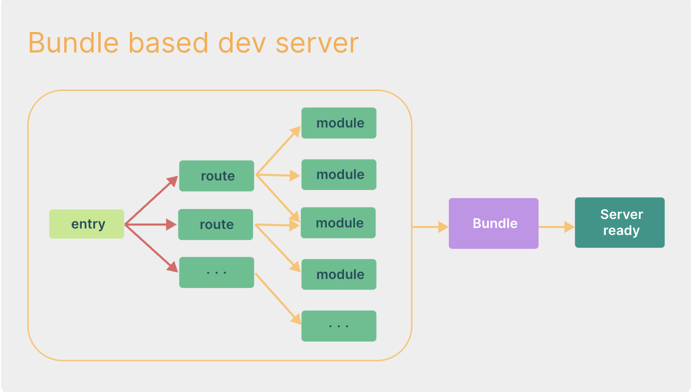
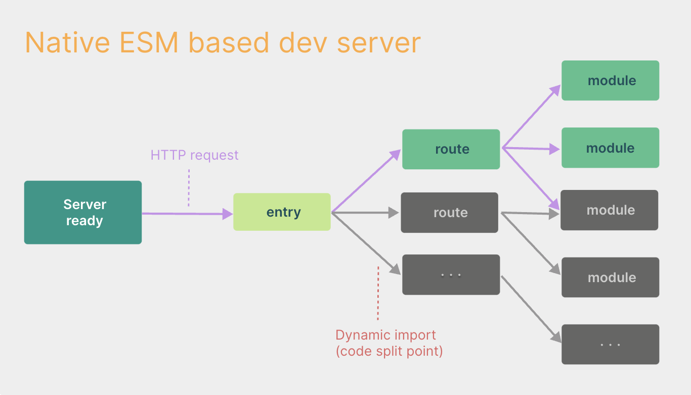
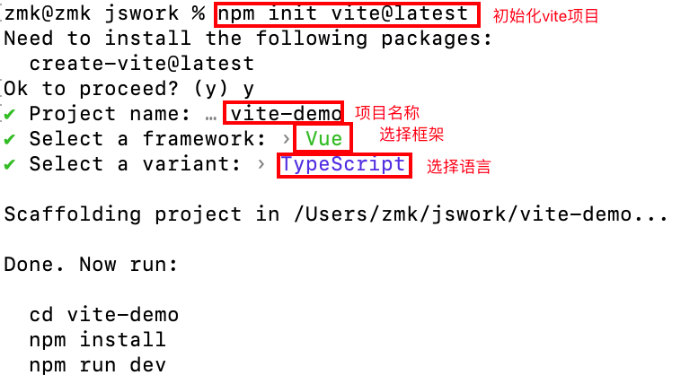
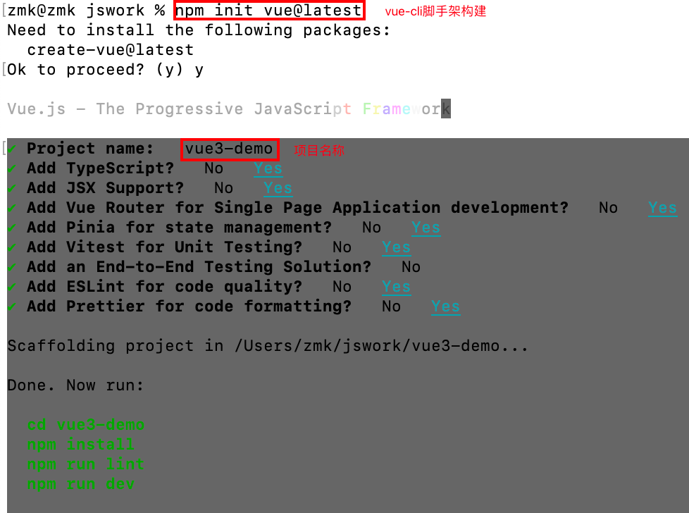

<!--
 * @Author: zhangmaokai zmkfml@163.com
 * @Date: 2023-01-09 09:58:33
 * @LastEditors: zhangmaokai zmkfml@163.com
 * @LastEditTime: 2023-08-16 09:34:43
 * @FilePath: /记录/FullStacker/frontend/vue3_ecology/Vite.md
 * @Description: vite学习
-->

### 🌟更详细的学习可以看着👉[Vite](https://cn.vitejs.dev/guide/)

在浏览器支持 ES 模块之前，JavaScript 并没有提供原生机制让开发者以模块化的方式进行开发。这也正是我们对 “打包” 这个概念熟悉的原因：使用工具抓取、处理并将我们的源码模块串联成可以在浏览器中运行的文件。

时过境迁，我们见证了诸如 [Webpack](https://webpack.js.org/)、[Rollup](https://rollupjs.org/guide/en/) 和 [Parcel](https://parceljs.org/) 等工具的变迁，它们极大地改善了前端开发者的开发体验。

然而，当我们开始构建越来越大型的应用时，需要处理的 JavaScript 代码量也呈指数级增长。包含数千个模块的大型项目相当普遍。基于 JavaScript 开发的工具就会开始遇到性能瓶颈：通常需要很长时间（甚至是几分钟！）才能启动开发服务器，即使使用模块热替换（HMR），文件修改后的效果也需要几秒钟才能在浏览器中反映出来。如此循环往复，迟钝的反馈会极大地影响开发者的开发效率和幸福感。

Vite 旨在利用生态系统中的新进展解决上述问题：浏览器开始原生支持 ES 模块，且越来越多 JavaScript 工具使用编译型语言编写。

#### 什么是Vite
Vite（法语意为 "快速的"，发音 /vit/，发音同 "veet"）是一种新型前端构建工具，能够显著提升前端开发体验。Vite 通过在一开始将应用中的模块区分为 **依赖** 和 **源码** 两类，改进了开发服务器启动时间。它主要由两部分组成：

- **一个开发服务器**，它基于 `原生 ES 模块` 提供了丰富的内建功能，如速度快到惊人的 模块热更新（HMR）。

- **[一套构建指令](https://cn.vitejs.dev/guide/cli.html)**，它使用 `Rollup` 打包你的代码，并且它是预配置的，可输出用于生产环境的高度优化过的静态资源。

Vite 以 原生 ESM 方式提供源码。这实际上是让浏览器接管了打包程序的部分工作：Vite 只需要在浏览器请求源码时进行转换并按需提供源码。根据情景动态导入代码，即只在当前屏幕上实际使用时才会被处理。

#### 为什么生产环境仍需打包
尽管原生 ESM 现在得到了广泛支持，但由于嵌套导入会导致额外的网络往返，在生产环境中发布未打包的 ESM 仍然效率低下（即使使用 HTTP/2）。为了在生产环境中获得最佳的加载性能，最好还是将代码进行 tree-shaking、懒加载和 chunk 分割（以获得更好的缓存）。

要确保开发服务器和生产环境构建之间的最优输出和行为一致并不容易。所以 Vite 附带了一套 构建优化 的 构建命令，开箱即用。

#### 为何不用 ESBuild 打包
虽然 `esbuild` 快得惊人，并且已经是一个在构建库方面比较出色的工具，但一些针对构建 应用 的重要功能仍然还在持续开发中 —— 特别是代码分割和 CSS 处理方面。就目前来说，Rollup 在应用打包方面更加成熟和灵活。尽管如此，当未来这些功能稳定后，也不排除使用 `esbuild` 作为生产构建器的可能。

> ⚠️兼容性注意：
Vite 需要 Node.js 版本 14.18+，16+。然而，有些模板需要依赖更高的 Node 版本才能正常运行，当你的包管理器发出警告时，请注意升级你的 Node 版本。

#### 配置环境
前置：安装vite `npm install vite -g`

1. 构建vue3 vite构建（简洁）：`npm init vite@latest`
示例：

2. 构建vue3 vue-cli脚手架构建（专门为vue项目构建、全一点）：`npm init vue@latest`
示例：

#### SFC 语法规范
*.vue 件都由三种类型的顶层语法块所组成：`<template>`、`<script>`、`<style>`

**`<template>`**
- 每个 *.vue 文件最多可同时包含一个顶层 `<template>` 块
- 其中的内容会被提取出来并传递给 @vue/compiler-dom，预编译为 JavaScript 的渲染函数，并附属到导出的组件上作为其 render 选项

**`<script>`**
- 每一个 *.vue 文件可以有多个 `<script>` 块 (不包括`<script setup>`)
- 该脚本将作为 ES Module 来执行
- 其默认导出的内容应该是 Vue 组件选项对象，它要么是一个普通的对象，要么是 defineComponent 的返回值

**`<script setup>`**
- 每个 *.vue 文件最多只能有一个 `<script setup>` 块 (不包括常规的 `<script>`)
- 该脚本会被预处理并作为组件的 setup() 函数使用，也就是说它会在每个组件实例中执行。`<script setup>` 的顶层绑定会自动暴露给模板。更多详情请查看 `<script setup>` 文档

**`<style>`**
- 一个 *.vue 文件可以包含多个 `<style>` 标签。
- `<style>` 标签可以通过 scoped 或 module attribute (更多详情请查看 SFC 样式特性) 将样式封装在当前组件内。多个不同封装模式的 `<style>` 标签可以在同一个组件中混